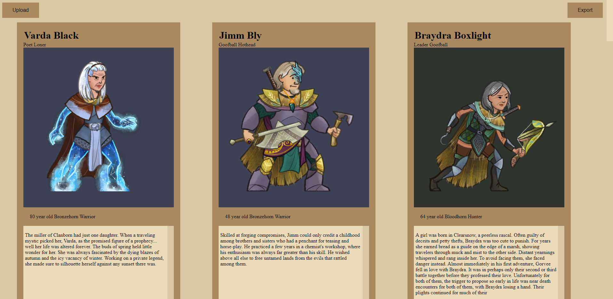
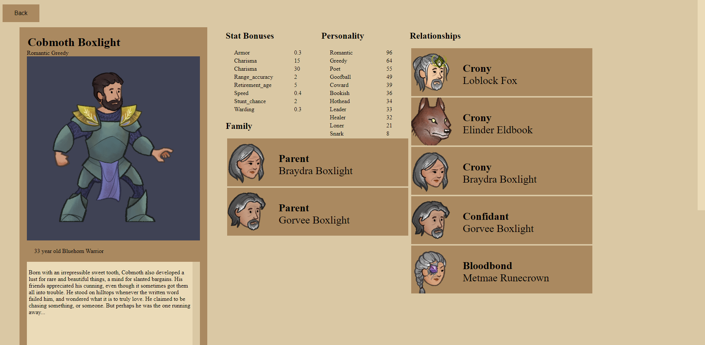
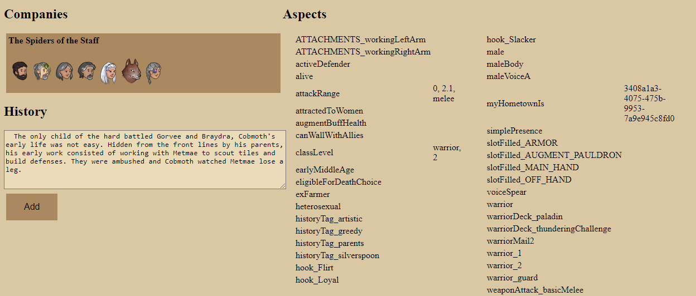

# Wildermyth Legacy

[Site](https://manapart.github.io/wildermyth-legacy/) that allows you to view your Wildermyth Legacy without having to start up the game.





## Deploying
```
cp -r ../wildermyth-legacy/build/distributions/* .
```

## Features

- Mobile Friendly
- List View
- Mark / view only Favorites
- Fast Search based on name, aspect, etc
- Hide NPCs (background) characters
- View Relationship levels for all snapshots
- View any snapshot of a character (each time you promote is a new snapshot)
- View Gear
- Better text interpolation for history events
- View full history, all aspects etc
- Create and update a per-character journal
- Click Relationship/Company faces to jump to that character
- New Network view shows how characters are related (can be moved around, click a face to go to that character)

https://manapart.github.io/wildermyth-legacy/

## Credits

- [ChartsCSS](https://github.com/ChartsCSS/charts.css)
- [Local Forage](https://github.com/localForage/localForage)
- [VisJs](https://github.com/visjs)
- [Graph Palette](https://www.pixilart.com/palettes/-62910)

## TODO

Details page
- add tag